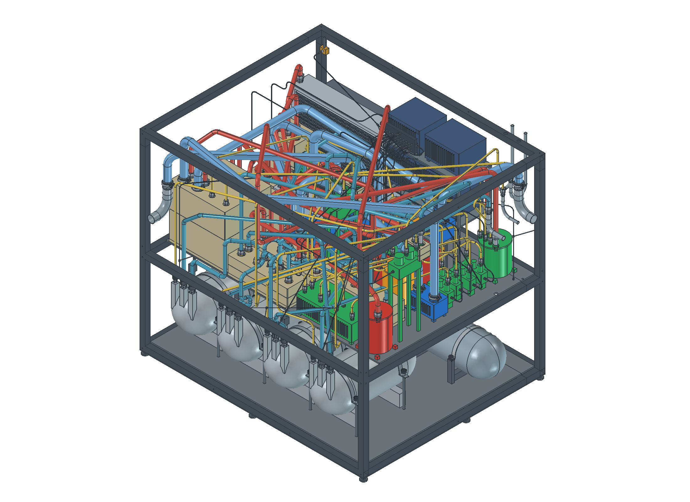
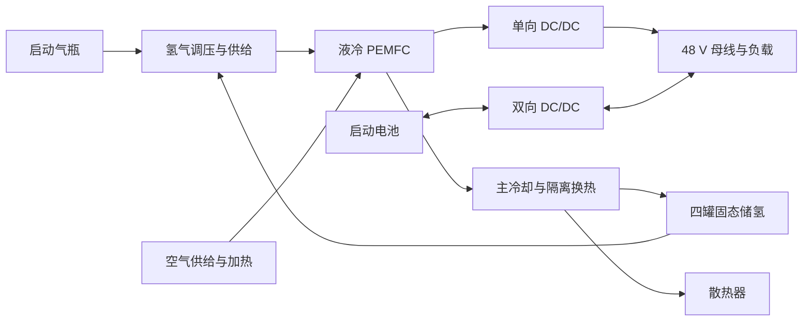

# 高寒高海拔 5 kW 氢能移动电源

**High-altitude & cold-climate hydrogen power — 开放设计与研发进度**

面向 −30°C 环境的液冷 PEM 燃料电池电源研究项目，组合固态储氢、启动气瓶、余热回收和 48 V 混合供电。本仓库展示目前的理论设计、三维布局、接口校核与计算源码。

**进度快照：2026-09-19 · 最新收录装配：R12 · 阶段：概念设计与安装空间复核。**
现有结果未证明已达到 5 kW 净输出、120 s 低温启动或寿命指标。



## 当前进展

| 工作 | 已有成果 | 仍待完成 |
|---|---|---|
| 系统设计 | 双氢源、双液路、燃料电池与电池混合供电方案 | 电堆和辅机参数冻结、版本间参数统一 |
| 计算 | 质量/能量/氢耗、海拔工况、PCT 外推与分床热模型源码 | 材料实测参数、模型标定及系统动态仿真 |
| R12 三维布局 | 1011 个零件对象、1203 个实体；外包络约 1724×1458.2×1505 mm | 安装顺序、维护路径与支承强度复核 |
| 管路和线束 | 69 条圆弧管路、21 条线束；126 个内部管端连接检查通过 | 工艺与实物装配验证 |
| 静态几何 | 既有检查记录中超 0.1 mm³ 干涉为 0；STEP 回读实体有效 | 不等同于压力、强度或制造合格 |
| 工具空间 | 112 个接口已筛查，40 个找到无碰撞姿态 | 72 个接口受限；六只容器完整取出路径待复核 |
| 电气设计 | R12 低压电气图、阀门统计 | 与采购定型器件和最终功率基线一致化 |

几何数据来自项目现有 R12 检查记录，本次公开整理没有重新运行 CAD 求解器。

## 阅读入口

- [R12 修改与检查说明](models/R12/R12_设计修改与检查说明.md)：当前装配范围、检查方法与未闭合问题。
- [几何与安装校核数据](models/R12/几何与安装校核数据.json)及[接口工具空间检查](models/R12/接口工具空间检查.csv)：可检查的结果记录。
- [9 月 9 日概念设计](docs/concept-design-20260909.md)、[BOM 与接口表](docs/bom-and-interfaces.md)、[参考来源](docs/references.md)。
- [版本与参数边界](docs/STATUS.md)：解释概念设计和 R12 装配的区别。
- [FreeCAD 可编辑模型](models/R12/3D燃料电池模型.FCStd) · [STEP 交换模型](models/R12/R12_紧凑分层_转角修复.step)。
- [电气图源文件](diagrams/electrical-R12.drawio) · [电气图预览](diagrams/electrical-R12.png)。

## 系统关系



功能图用于阅读；DC/DC 类型、压力与容量应按相应版本文件核对。

## 复算概念设计

需要 Python 3.10+ 和 Matplotlib。以下命令在仓库根目录执行：

```bash
python -m venv .venv
# Windows: .venv\Scripts\activate
# macOS/Linux: source .venv/bin/activate
python -m pip install -r requirements.txt
python tools/calculate.py
```

脚本更新 `calculations/parameters.json`，生成分床温度数据及两幅图，并检查能量守恒残差。图表原脚本使用 Microsoft YaHei；未安装该字体的平台可能出现中文字体提示。

计算对应 **2026-09-09 的 70 节概念方案**：156 A、0.65 V/节时毛功率 7.098 kW；变换效率 96%、辅机 1.30 kW 时净功率估算 5.514 kW。该结果不代表实测性能，也不能直接替代 R12 的储氢容量分配。

## 下一步

- [ ] 统一 R12 装配、技术报告、电气图与概念计算的参数基线。
- [ ] 调整受限阀组和管廊，复核 72 个接口的工具进入路径。
- [ ] 完成储氢模块整件取出路径及 R12 分层支承强度校核。
- [ ] 取得材料 PCT/动力学及阀泵、电堆、高原空气系统的供应商数据。
- [ ] 完成 Fluent 基准/强化床对比和整机低温动态仿真。
- [ ] 通过台架验证冷启动、净功率、热利用率及耐久目标。

## 开源范围

项目原创代码、文档和设计文件采用 [MIT License](LICENSE)。第三方商标、专利及引用资料的权利仍归其权利人；本仓库仅保留来源引用，不分发原始厂商 CAD 库、下载论文和内部参考资料。

这是研究与概念设计资料，不能直接作为压力容器制造或氢系统运行依据。欢迎通过 Issue 提交参数来源、计算修正和装配空间建议；见 [贡献说明](CONTRIBUTING.md)。
